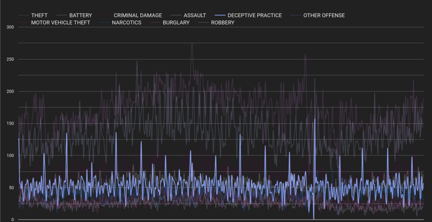
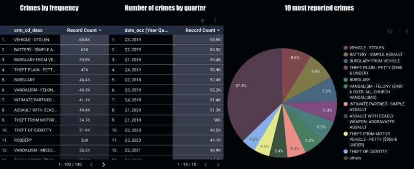
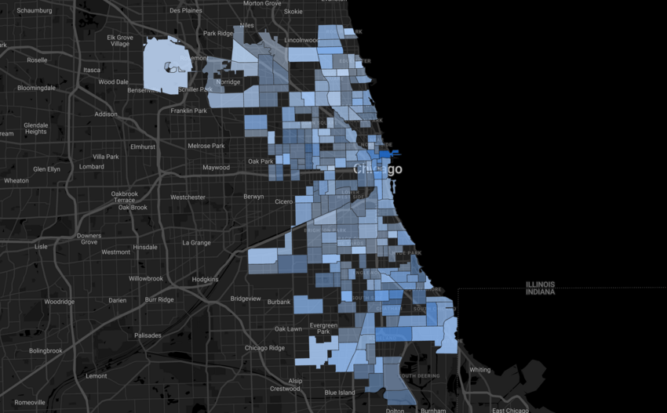
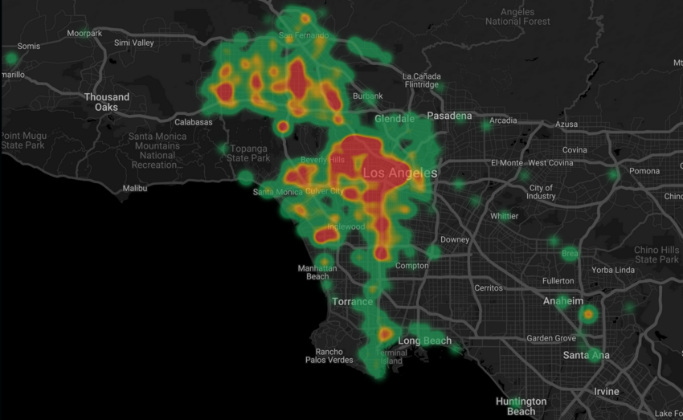
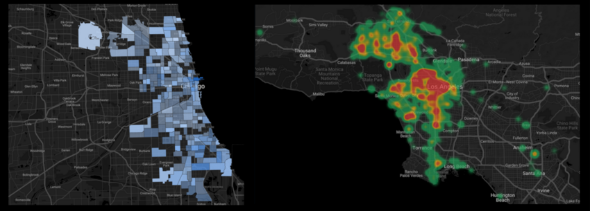

# Code Review: Team Week 2

#### By Alejandro Socarras, Drew White, Phil Kendall

###  _Exploring Crime in Major US Cities_

This repository demonstrates the creation of basic ELT pipelines using city crime data sourced from public kaggle datasets. 

1. Set up a group project in Google Cloud, with service account authorizations and SDK access for multiple remote users. 
2. Load datasets to BigQuery using Python API. 
3. Connect Google Cloud project to shared DBT repository. 
4. Perform transformations in SQL using DBT. 
5. Connect transformed data to dashboards in Looker Studio. 

### Technologies Used

* Python
* BigQuery
* DBT
* Looker Studio
  
### Dashboards and Visualizations 


<!--   -->


#### _[Dashboard #1 (Drew White)](https://datastudio.google.com/reporting/5dafe154-fb0b-4188-8836-9249e075aacf)_
#### _[Dashboard #2 (Alejandro Socarras)](https://datastudio.google.com/reporting/d14cea99-515b-40f4-a3da-bb06626ad1ad)_


### Datasets Used

* https://www.kaggle.com/datasets/onlyrohit/crimes-in-chicago
* https://www.kaggle.com/datasets/paultimothymooney/denver-crime-data

</br>

### Setup/Installation Requirements
* Make a new directory for your project
  ```bash
  mkdir <new-directory>
  cd <new-directory>
  ```
* Clone the repository by inputting: 
  ```bash
  git clone https://github.com/apsocarras/team-week2.git
  ```
* Once in the directory you will need to set up a virtual environment in your terminal:
  ```bash
  python3.7 -m venv venv
  ## Alternatively: virtualenv -p python3.7 venv
  ```
* Then activate the environment:
  ```bash
  source venv/bin/activate
  ```
* Install the necessary items with requirements.txt:
  ```bash
    pip install -r requirements.txt
  ```
* With your virtual environment now enabled with proper requirements, open the directory:
  ```bash
  code .
  ```
</br>

## Known Bugs

* No known bugs

<br>

## License

MIT License

Copyright (c) 2022 Alejandro Socarras, Drew White, Phil Kendall

Permission is hereby granted, free of charge, to any person obtaining a copy of this software and associated documentation files (the "Software"), to deal in the Software without restriction, including without limitation the rights to use, copy, modify, merge, publish, distribute, sublicense, and/or sell copies of the Software, and to permit persons to whom the Software is furnished to do so, subject to the following conditions:

The above copyright notice and this permission notice shall be included in all copies or substantial portions of the Software.

THE SOFTWARE IS PROVIDED "AS IS", WITHOUT WARRANTY OF ANY KIND, EXPRESS OR IMPLIED, INCLUDING BUT NOT LIMITED TO THE WARRANTIES OF MERCHANTABILITY, FITNESS FOR A PARTICULAR PURPOSE AND NONINFRINGEMENT. IN NO EVENT SHALL THE AUTHORS OR COPYRIGHT HOLDERS BE LIABLE FOR ANY CLAIM, DAMAGES OR OTHER LIABILITY, WHETHER IN AN ACTION OF CONTRACT, TORT OR OTHERWISE, ARISING FROM, OUT OF OR IN CONNECTION WITH THE SOFTWARE OR THE USE OR OTHER DEALINGS IN THE SOFTWARE.

</br>
