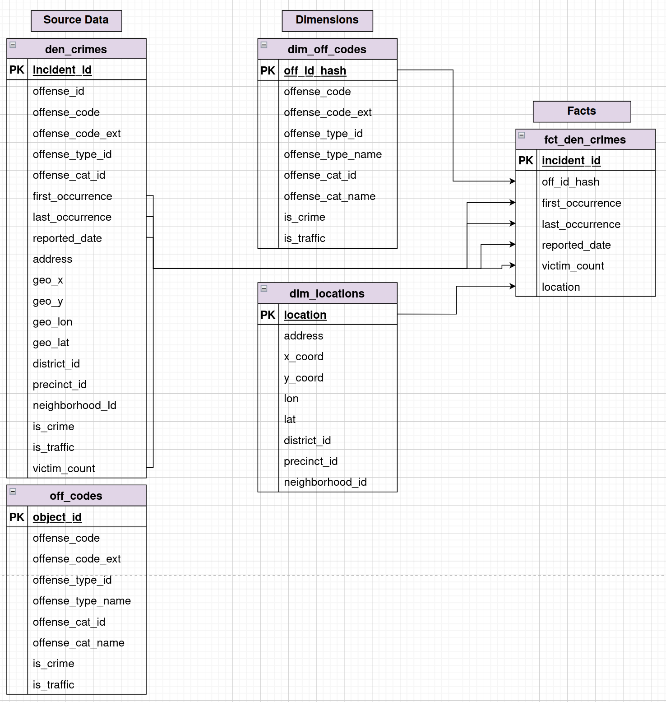
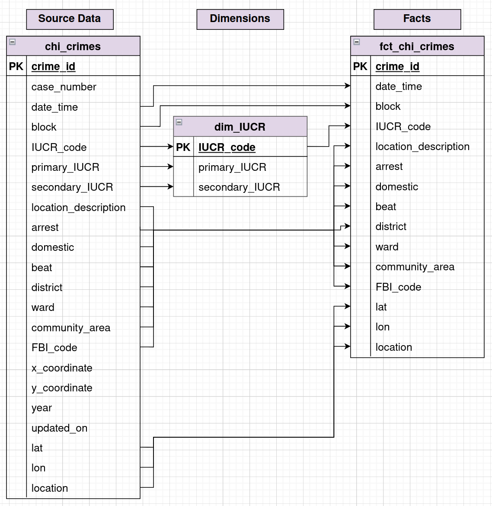
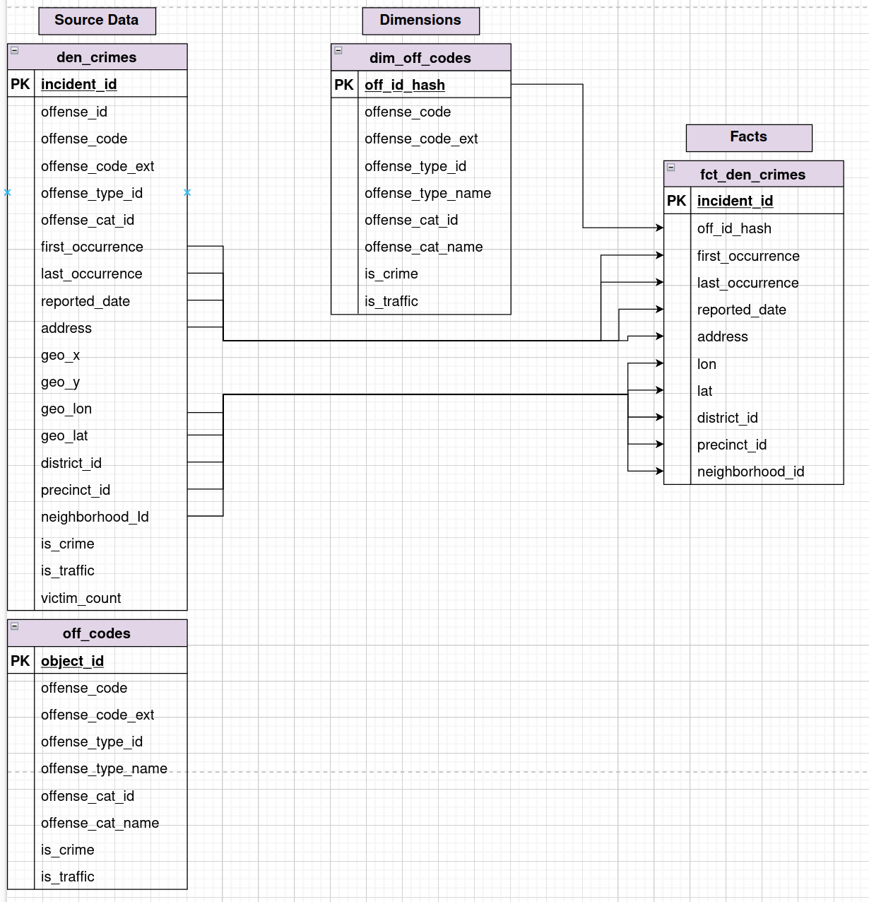

# ERDs for Chicago and Denver Crime Data
## Version 1
The structure of these datasets are similar: the facts being measured are individual crimes and the dimensions are time, location, and type of crime. Location and type of crime can in principle be sorted into dimension tables.  

### Denver

### Chicago

However, the Chicago dataset is less amenable to denormalization. Contrary to what you might expect, there is no 1-to-1 association between any location metric or subgroup of location metrics from which you could connect to a location table. One set of coordinates can connect to multiple police beats (to a maximum of 20!), a single police beat to multiple districts, etc. It's unclear looking at this dataset alone whether this is partially due to changes in how CPD designated area boundaries or  inaccuracies in data entry. 

As for the IUCR codes, we can construct a table similar to the `off_codes` table for the denver crime dataset, but we have to standardize spellings/data entry conventions for the primary and second IUCR descriptions. 

## Version 2
### Denver

Unfortunately, the Denver dataset suffers from the same issues when trying to make a location dimension table. Better to just make a dimension table for the offenses.  